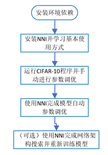

<!--Copyright © Microsoft Corporation. All rights reserved.
  适用于[License](https://github.com/microsoft/AI-System/blob/main/LICENSE)版权许可-->

# 自动机器学习系统与工具

- [9.2 自动机器学习系统与工具](#92-自动机器学习系统与工具)
  - [9.2.1 自动机器学习系统与工具概述](#921-自动机器学习系统与工具概述)
  - [9.2.2 探索式训练过程](#922-探索式训练过程)
  - [9.2.3 自动机器学习编程范式](#923-自动机器学习编程范式)
  - [9.2.4 自动机器学习系统优化前沿](#924-自动机器学习系统优化前沿)
  - [9.2.5 自动机器学习工具概述与实例分析](#925-自动机器学习工具概述与实例分析)
  - [9.2.6 自动机器学习系统练习](#926-自动机器学习系统练习)
  - [小结与讨论](#小结与讨论)
  - [参考文献](#参考文献)

## 自动机器学习系统与工具概述

自动机器学习工具能够使机器学习模型的设计和调优变得简单而可扩展，使机器学习广泛赋能各个行业、各类场景。在传统的MLops中，机器学习模型的设计环节占比较少，更多是围绕着运维方面做模型的部署、监控、升级。随着机器学习模型特别是深度学习模型越来越多的部署在各类应用中，模型的定制化需求也变得越来越高，比如不同的场景对模型精度、模型大小、推理延迟有不同的要求。这使得模型的设计与部署越来越紧密的结合在一起，成为未来MLops中的重要一环。因此，自动机器学习工具会变得越来越重要，成为模型设计与部署的重要一环，甚至成为核心环节。

一个自动机器学习工具的设计需要兼顾很多方面，如易用性（easy-to-use）、灵活性（flexibility）、扩展性（scalability）和有效性（effectiveness）。

- 易用性是指用户容易上手，对工具的学习曲线较为平缓。易用性不仅是文档的问题，更多的是工具中各级用户接口的设计。在自动机器学习中，易用性主要关注两类使用场景。一是用户已经有了初步的模型，如何利用工具快速调优模型至满足应用需求。二是用户没有模型，仅有应用需求和数据，工具如何协助用户获得满足需求的模型。

- 灵活性是指用户不仅可以利用工具提供的算法快速得到效果不错的模型，还可以通过细粒度的配置和定制模型结构、搜索策略等，进一步提升模型的效果。一个灵活性较高的工具通常模块化程度较高，提供多层用户接口，支持各个层级与组件的定制与组合。

- 扩展性是指一个模型调优任务可以灵活调整使用的计算资源的多少，比如，可以使用单台机器，也可以使用成百上千的机器。自动机器学习任务通常具有很高的可并行性，通过运行相互独立的试验，探索整个优化空间。自动机器学习工具为了提供可扩展性通常需要通过集成集群管理平台来完成，或者是直接在某个集群管理平台原生支持自动机器学习的功能。

- 有效性是指工具提供的算法和系统优化可以加速搜索模型的进程。算法的有效性是工具有效性的核心，有效的搜索算法可以通过迁移学习、多保真（multi-fidelity）技术、搜索空间的优化、解空间的精准建模等技术，来提升搜索的有效性。另一方面，系统优化也是加速搜索的一种手段，通过使用更少的计算资源获得相同的搜索结果。

目前，自动机器学习工具已大量涌现，在功能上主要分为两类：面向端到端的（end-to-end）自动模型生成工具和面向模型开发及流程定制的半自动模型生成工具。前者在使用接口上更加简单，通常提供`tool.fit(training_data)`和`tool.predict(one_sample)`这类用户接口。其中，`fit`是根据用户提供的目标训练数据，得到最优的机器学习模型；`predict`是使用搜索得到的最优模型做模型推理（inference）。提供这类接口的自动机器学习工具有[Auto-Sklearn](https://automl.github.io/auto-sklearn/master/)、[AutoKeras](https://github.com/keras-team/autokeras)。面向模型开发和流程定制的半自动模型生成相比于前者提供了更大的灵活性。它通常提供丰富的算法库，更加灵活的配置接口。用户可以灵活选择使用什么样的搜索算法、设计什么样的搜索空间、配置什么样的模型优化目标等定制化需求。这类工具包括[NNI](https://github.com/microsoft/nni)、[Ray](https://github.com/ray-project/ray)。其实，上述的两类自动机器学习工具并不冲突，可以看作一种互补，即前者可以架构于后者之上。在面向模型开发和流程定制的自动机器学习工具之上可以构建各种端到端的自动机器学习应用。

另一方面，在自动机器学习工具的使用和部署方式上又可以分为两类：以工具库（library）的形式和以服务的形式（或称之为云原生的形式）。以工具库的形式通常安装非常简便，只需一行安装命令，相对轻量，可以安装在不同的系统和环境中。另一类是以服务的形式，这类工具直接以服务的形式部署在云上，并关联的解决数据存储、实验管理、可视化分析等一系列功能。使用体验更好，但是相应的会让用户花费更高的成本。这两种工具的提供形式也不冲突，结合软件即服务（Software as a Service，SaaS）的思想，一个好的以工具库的形式设计的自动机器学习工具也可以以服务的形式部署在云上。

机器学习模型充当的是助力和赋能的角色，因此应用场景众多。自动机器学习工具的设计需要权衡通用性和定制化。过于通用会使工具离实际应用太远，无法很好支持自动机器学习任务。过于定制化，又使自动机器学习应用很难扩展，沦为某种形式的软件外包。这就要求在自动机器学习工具的设计过程中，提取共性，抽象出通用模块，设计具有可扩展性的接口，合理拆分系统层级。

自动机器学习工具有两大部分构成。一部分是算法，即各类超参数搜索算法，神经网络结构搜索算法，模型压缩算法等等在模型设计、调优和部署过程中涉及到的各种算法和流程。另一部分是平台和系统，用以支持算法的高效以及分布式运行的。

算法部分已经在上一节做了介绍。接下来，从平台和系统方面，分别从统一的运行模式，下一代编程范式，和前沿的系统优化，介绍自动机器学习系统中的几个关键组成。最后使用自动机器学习工具NNI做实例分析，并提供实验强化对本节的理解。

## 探索式训练过程

***探索式训练是前沿论文共同影射出来的方向***

在机器学习模型的设计、调优和部署的过程中，试错(trial-and-error)是机器学习模型开发者的统一行为模式。机器学习模型很难通过一次性的模型设计就满足应用的要求，而通常是经过反复的迭代和调优。自动机器学习是对开发者调优模型的一种模拟，因此它也遵循试错的行为模式，就像图9-1-1中展示的那样。

对每一个具体的机器学习应用，所需要的机器学习模型会隐式的存在一个设计和调优的空间，模型开发者对模型的设计和调优实际是在这个空间中进行的探索。在这个空间中探索最优模型被称之为[**探索式训练**](https://www.usenix.org/system/files/osdi20-zhang_quanlu.pdf)。

探索式训练的本质是将传统的单模型训练转变为在一个模型空间（即搜索空间）中模型调优和训练相结合的过程，也即将模型调优囊括到模型训练的过程中。图9-2-1展示了神经网络结构搜索中几种探索式训练的例子。如图9-2-1(a)所示，在模型设计过程中，将一层中的算子替换成其他类型算子是一种常见模型修改方式，修改模型是为了探索出表现更优的模型。另外，模型中算子之间的连接也会影响模型的表现，所以改变连接也是常见的调优方式，比如增加跳线(skip connection)。另外开发人员也会基于某种规则对模型做变化，比如在模型中所有Conv2d算子的后面添加BatchNorm算子，或者将BatchNorm统一替换成LayerNorm。如图9-2-1(b)所示，开发人员会尝试将某种模型结构做适当泛化。比如对一个特定的Inception cell的多分支结构做泛化，尝试不同的分支数，以及在不同分支上尝试不同的算子。如图9-2-1(c)所示，开发人员也会设计若干规则，在一个基础模型上不断的应用这些规则使模型逐渐变大。

 

图9-2-1. 探索式训练的例子

通常这些对模型的细粒度的改变和调优是模型开发者难以根据经验准确知道调优结果（即模型表现会变好还是变坏），需要实际将模型训练后得到其表现。因此将这类调优和模型训练结合到一起可以让开发人员更专注于模型骨架的设计，而将这种细粒度调优留给自动化搜索。

## 自动机器学习编程范式

***前沿的编程接口***

探索式训练使模型开发者在模型设计过程中可以含糊得表达一个大致的模型设计思路，而让自动机器学习通过搜索的方式丰富模型的各个细节。如何设计一个服务于这种需求的编程范式是一个挑战，它需要既可以简单地表达模型空间又具有较强的表达能力。

从图9-2-1以及模型开发者调优模型的行为模式，可以看出模型的设计和调优本质上是一个不断改变(mutate)模型的过程。因此表达一个模型空间等价于表达模型的一个可变化范围。例如，神经网络模型中的一层中初始使用的是Conv3x3算子，开发人员可以通过模型变化将其替换成Conv5x5，或者替换成Maxpool，来验证模型效果是否有提升。这里模型的变化是由变化方式（例如算子的替换操作）和变化空间（例如替换成Conv3x3、Conv5x5或者Maxpool）构成的。例如图9-2-1(b)中的模型变化，其变化方式是增加删除分支和替换分支上的算子，变化空间是所有候选的分支数量和所有的候选算子。

模型形变(mutation)就是表达模型空间的一种编程抽象。它将深度学习模型看作一个计算流图(data flow graph)，并提供两类原语(primitive)来操作模型完成模型形变：一类是图操作原语，即图的增删查改，用以灵活的变化模型；另一类是表达变化空间的原语，例如API *choice()*是从多个候选中选择一个。一个完整的模型空间是由一个初始模型(base model)和模型形变构成的。图9-2-2是用模型形变描述出的模型空间的一个示例，图9-2-2(a)是初始模型。该示例中的模型空间是将模型第三层“model/maxpool”替换成一个类似inception cell的层。这个层可以有2到5个分支，每个分支上的算子可以从3个候选算子（即Conv、DepthwiseConv或者Maxpool）中选1个。图9-2-2(b)用图示描述了该模型形变。图9-2-2(c)是利用上述编程范式实现的一个模型空间的代码。其中，“InceptionMutator”是模型变化的伪代码，它在
“mutate”函数中确定一个具体的分支数量（第9行），对于每个分支从候选算子中选择一个并连接到模型中。最后使用“apply_mutator”将这个模型变化应用到模型的目标位置上，即“model/maxpool”。

 

图9-2-2. 一个模型空间的示例

通过模型形变表述模型空间的这种新编程范式可以将模型空间的表达、搜索算法和系统优化三者有机地结合起来，并得到下面三个特性。
  - 任意的模型空间均可由该编程范式灵活表达；
  - 通过该编程接口表达的模型空间可以被搜索算法正确解析，大大提升搜索算法的可复用性。
  - 系统层面，模型在探索式训练的过程中做的任何变化都可以被精准定位，使得模型和模型之间的关系变得非常清晰，从而打开了跨模型优化的机会。

***更加易用的编程接口***

模型形变是表达模型空间的核心抽象，虽然具有很大的灵活性，但是在编程的易用性上稍有欠缺。因此在该编程范式之上可以提供更加简洁易用的语法糖（syntactic sugar）。在神经网络结构搜索中，有三个API较为常用，可以构建出大部分模型空间。它们分别是“LayerChoice”，“InputChoice”和“ValueChoice”。“LayerChoice”是创建模型中的一层，该层的算子是从一系列候选算子中选择一个。“InputChoice”是创建连接，允许从一系列候选张量(tensor)中选择一个或者多个张量作为模型中一个层的输入。“ValueChoice”是从多个候选数值中选择一个，比如用来选择dropout rate的大小。这些API可以直接在编写PyTorch或者Tensorflow的模型代码中使用，将编写的模型变为一个模型空间。

## 自动机器学习系统优化前沿

***自动机器学习系统架构***

自动机器学习系统一般由四部分构成，如图9-2-3所示。模型空间分析器将用户编写的模型空间解析成系统可以理解和优化的中间表达(intermediate representation)。然后模型生成器可以进行模型生成。生成什么模型是由探索式训练控制器决定。模型控制器中会运行一个搜索算法，来决定要探索到具体哪一个或者一些模型。生成的模型可以由跨模型优化器做一系列系统上的优化加速。最后优化后的模型被放到模型训练平台（如Kubernetes）上训练。训练的结果（如模型精度）会反馈给探索式训练控制器用于指导之后的模型生成。

 

图9-2-3. 自动机器学习系统架构

***前沿的自动机器学习优化技术***

探索式训练区别于以往的模型训练在于它的目标不再是将一个单一的模型训练好，而是快速发现模型空间中表现好的模型并将其训练好。这就带来了新的系统优化机会。常见的主要有三类优化，一类是利用模型之间的相似性加速多个模型的训练，第二类是加速探索式训练过程，第三类是针对某些探索式训练做定制化的优化。下面依次介绍。

***多模型训练加速***

探索式训练有两个特点：一次可以生成多个模型进行探索，生成的模型之间有很大的相似性。这给跨模型优化带来了很大的优化空间。(i) 由于生成的模型之间相似性很大，这些模型可以共用模型中相同的部分，比如使用相同的数据集，相同的数据预处理逻辑，甚至是相同的子模型。图9-2-4是一个这样的例子。因此，这些相同的计算可以通过去重变成一份。通过对整合后的模型做合理的切分并放置到不同的计算设备上，可以达到总体更快的训练速度。

 

图9-2-4. 跨模型优化示例

（ii）上面介绍的优化更多的是去重那些没有训练参数的模型部分，对于有训练参数的模型部分，由于每一个模型需要训练自己的参数，因此不能做去重。这时可以做模型之间的融合(fuse)。前面章节介绍过模型优化中的算子融合，即相邻的两个算子可以融合成一个算子从而提升运行效率。而在自动机器学习系统里的算子融合通常表示不同模型中对应位置的相同算子可以融合在一起，从而达到提升设备利用率(utilization)的效果。这种优化对于小模型的探索式训练非常有效，通过模型之间的融合可以充分利用计算设备上的计算资源。这种优化在[Retiarii](https://www.usenix.org/system/files/osdi20-zhang_quanlu.pdf)和[HFTA](https://proceedings.mlsys.org/paper/2021/file/a97da629b098b75c294dffdc3e463904-Paper.pdf)两个研究工作中均有被提出。

***探索式训练过程的加速***

探索式训练过程也可以被有效加速，通过对模型训练做合理的资源分配和调度。这里介绍两种优化技术。一种是时分复用的模型训练。这种方式会分配少量计算资源给一个新生成的模型，用于初步估计这个模型的效果。如果表现较好则保留继续参与下一轮的时分复用，如果表现不好则直接剔除。这样可以在使用相同量计算资源的情况下，尝试更多的模型，从而快速发现表现好的那些模型。这种优化方法最早在[Gandiva](https://www.usenix.org/conference/osdi18/presentation/xiao)中被提出。另一种优化技术是通过评估正在训练的模型的表现，动态调整分配给它们的计算资源，表现好的模型会被分配更多资源，而表现较差的模型被分配到的资源会相对较少。它与时分复用的区别在于，它调整资源的维度不在时间维度上，而是在资源的数量维度上，即通过调整模型可以使用的计算资源量来提升探索式训练的效率。早停算法可以看作是这种资源调度的一种极端情况。

***针对具体场景优化***

探索式训练过程有很多算法，例如9.1节中介绍的多试验搜索和单发搜索。单发搜索在行为上非常特殊，是将候选的模型结构合并成一个超网络，每一个minibatch只激活该超模型中的一个子模型。这种超模型的分布式训练需要有特殊设计的模型并行（model parallelism）策略。典型的方法有混合并行（[mixed parallelism](https://www.usenix.org/system/files/osdi20-zhang_quanlu.pdf)）和[NASPipe](https://drive.google.com/file/d/1gUCAVK0UjN86kuaZbbdjFnsYNDiSgxXK/view)。

## 自动机器学习工具概述与实例分析

***自动机器学习工具概述***

目前市面上的自动机器学习工具种类繁多，侧重点各有不同。自动机器学习工具在围绕着三个核心能力发展和演进。

  - 模型自动设计与调优的算法。有些自动机器学习工具仅提供一种模型设计和调优算法，如Auto-Sklearn，TPOT，H2O AutoML，AutoKeras。这类工具通常提供十分简洁的用户接口，如`tool.fit`，`tool.predict`。由于不同的机器学习任务（如图像识别，文本分类）通常需要不同的模型设计空间和搜索方式，这类工具会分任务做定制化模型搜索。Auto-Sklearn和TPOT主要针对scikit-learn中的传统机器学习算法，AutoKeras则主要针对深度学习模型。另外一些自动机器学习工具通过模块化设计提供一系列主流的模型搜索算法（如9.1节中介绍的算法），由用户根据自己的需求选择合适的搜索算法应用到自己的任务中，如NNI，Ray。这类工具的定位偏重于辅助模型开发者设计和调优模型。另外，一些工具，如Ray，Weights&Biases，MLflow，在算法上主要支持的是超参数搜索算法。而且Weights&Biases和MLflow虽然有超参数搜索的能力，但是他们在工具的定位上是机器学习训练任务的管理工具。
  - 分布式模型搜索与训练的能力。模型搜索通常需要较多的计算资源。一些自动机器学习工具可以连接到不同类型的计算资源上，比如远程的计算服务器，Kubernetes集群，云计算服务。如Ray和NNI都可以连接不同的计算资源，其中NNI是用统一的接口将不同的计算资源封装起来，令模型搜索无差别的使用不同类型的计算资源（后面会详细介绍）。Ray设计了一种结合了调度能力的远程过程调用（即`ray.remote`），将计算分发到不同的计算节点上。Weights&Biases也具有类似的功能，将试验分发到用户提供的机器上运行。auto-sklearn、AutoKeras没有提供分布式的能力。有些自动机器学习工具与集群管理工具或者云服务紧耦合，如Kubeflow（Kubeflow是在kubernetes上构建的，针对机器学习任务运行和部署的工具）中原生支持的自动机器学习工具Katib。在Katib中，整个超参数搜索的配置，如需要搜索的超参数及取值范围、搜索并行度，直接写到了机器学习训练任务的配置文件中。无论上述哪种方式的分布式能力，只需合理的封装，都可以在云上以SaaS的形式提供自动机器学习能力。
  - 编程接口与用户交互。现有的自动机器学习工具虽然提供的编程接口各不相同，但是总体可以分为两类。一类是用户提供任务数据，工具直接返回搜索到的好的模型，即上述的Auto-Sklearn，TPOT等。另一类是用户需要自己编写或者指定模型，指定搜索空间及合适的搜索算法，来完成搜索过程。用户编写和指定这些内容的方式也有多种，一些工具是通过配置文件描述搜索空间，有些是在Python代码里以dict直接描述，还有些为了描述搜索空间的简便，支持将超参数的可行域直接在模型使用该超参数的对应位置描述出来，如NNI中的ValueChoice。在试验代码的编程方式也有多种，一类是试验代码作为一个独立脚本，通过命令行参数或者工具提供的API和搜索过程交互。另一类是将试验代码写作一个函数，其输入参数是超参数的取值，返回值是该组超参数取值下的表现。前者在试验的隔离性上更优一点，后者在试验代码编写上（特别是较简单的试验代码）更友好一点。用户交互方面有两种模式：命令行和图形化。图形化是机器学习模型开发的有力工具，仅仅针对深度学习模型训练的可视化和管理工具已经涌现出很多，如TensorBoard，Weights&Biases，MLflow。在自动机器学习工具中可视化也是重要的组成部分，每个试验的训练信息，试验之间的对比，搜索过程的演进，搜索出的模型的可视化，以及实验管理等。可以将自动机器学习的可视化视为传统深度学习模型训练可视化的增强。

***NNI***

NNI是轻量级自动机器学习工具，其中主要包括超参数搜索、网络结构搜索和模型压缩。这三种类型的任务有一个共同的特点，即不断尝试新的候选模型结构或者模型配置。每一个候选需要评估其表现。因此，一个自动机器学习工具需要具备的基本功能是机器学习模型评估任务的分发。NNI提供了向不同训练平台分发任务的能力，应用不同搜索算法的能力，以及友好的用户编程和交互接口。

 

图9-2-5. 自动机器学习工具NNI的基础架构

图9-2-5展示了NNI的基础架构。首先，任务分发能力是由图中的Training service提供，每一个训练平台都可以通过Training service供自动机器学习任务使用。Tuner/Assesor是搜索算法，NNI提供的编程接口可以支持复杂的搜索算法实现。图左侧是用户编程接口和实验管理接口。

## 自动机器学习系统练习

***实验目的***

通过试用 NNI 了解自动机器学习，熟悉自动机器学习中的基本概念

***实验环境***

* Ubuntu
* Python==3.7.6
* NNI==1.8
* PyTorch==1.5.0

***实验原理***

在本实验中，我们将处理 CIFAR-10 图片分类数据集。基于一个表现较差的基准模型和训练方法，我们将使用自动机器学习的方法进行模型选择和优化、超参数调优，从而得到一个准确率较高的模型。

***实验内容***

*实验流程图*

<!--  -->

图: 实验流程图 

*具体步骤*

1. 熟悉 PyTorch 和 CIFAR-10 图像分类数据集。可以先阅读教程：https://pytorch.org/tutorials/beginner/blitz/cifar10_tutorial.html 
   
2. 熟悉 NNI 的基本使用。阅读教程：https://nni.readthedocs.io/en/latest/Tutorial/QuickStart.html 
   
3. 运行CIFAR-10代码并观察训练结果。在实验目录下，找到 `hpo/main.py`，运行程序，记录模型预测的准确率。
   
4. 手动参数调优。通过修改命令行参数来手动调整超参，以提升模型预测准确率。记录调整后的超参名称和数值，记录最终准确率。
   
   **注：**
   main.py 暴露大量的命令行选项，可以进行调整，命令行选项可以直接从代码中查找，或通过 `python main.py -h` 查看。例如，`--model`（默认是 resnet18），`--initial_lr`（默认是 0.1），`--epochs`（默认是 300）等等。一种简单的方法是通过手工的方法调整参数（例如 `python main.py --model resnet50 --initial_lr 0.01`）然后根据结果再做调整。
5. 使用 NNI 加速参数调优过程。
   
    1. 参考NNI的基本使用教程，安装NNI（建议在Linux系统中安装NNI并运行实验）。
    2. 参照NNI教程运行 `mnist-pytorch` 样例程序（程序地址： https://github.com/microsoft/nni/tree/master/examples/trials/mnist-pytorch  ），测试安装正确性，并熟悉NNI的基本使用方法。
    3. 使用NNI自动调参功能调试hpo目录下CIFAR-10程序的超参。创建 `search_space.json` 文件并编写搜索空间（即每个参数的范围是什么），创建 `config.yml` 文件配置实验（可以视资源量决定搜索空间的大小和并行量），运行程序。在 NNI 的 WebUI 查看超参搜索结果，记录结果截图，并记录得出最好准确率的超参配置。
   
6.	（可选）上一步中进行的模型选择，是在若干个前人发现的比较好的模型中选择一个。此外，还可以用自动机器学习的方法选择模型，即网络架构搜索（NAS）。请参考nas目录下 `model.py`，采用 DARTS 的搜索空间，选择合适的 Trainer，进行搜索训练。记录搜索结果架构，并用此模型重新训练，记录最终训练准确率。

**注：** 搜索完成后得到的准确率并不是实际准确率，需要使用搜索到的模型重新进行单独的训练。具体请参考 NNI NAS 文档：https://nni.readthedocs.io/en/latest/nas.html

***实验报告***

*实验环境*

||||
|--------|--------------|--------------------------|
|硬件环境 | CPU（vCPU数目）| &nbsp; &nbsp; &nbsp; &nbsp; &nbsp; &nbsp; &nbsp; &nbsp; &nbsp; &nbsp; &nbsp; &nbsp; &nbsp; &nbsp; &nbsp; &nbsp; &nbsp; &nbsp; &nbsp; &nbsp; |
| | GPU(型号，数目) | |
| 软件环境 | OS版本 | |
| | 深度学习框架 python包名称及版本 | |
| | CUDA版本 | |
||||

*实验结果*

1.	记录不同调参方式下，cifar10程序训练结果的准确率。

||||
|---------|-----------------|------------|
| 调参方式 | &nbsp; &nbsp; 超参名称和设置值 &nbsp; &nbsp; | &nbsp; &nbsp; 模型准确率 &nbsp; &nbsp; |
| &nbsp;   &nbsp; 原始代码 &nbsp;   &nbsp; |||
| &nbsp;   &nbsp; 手动调参 &nbsp;   &nbsp; |||
| &nbsp;   &nbsp; NNI自动调参 &nbsp;   &nbsp; |||
| &nbsp;   &nbsp; 网络架构搜索  &nbsp; &nbsp; （可选）   &nbsp; |||
||||
2.	提交使用NNI自动调参方式，对 main.py、search_space.json、config.yml 改动的代码文件或截图。

 

 

3.	提交使用NNI自动调参方式，Web UI上的结果截图。

 

 

4.	（可选）提交 NAS 的搜索空间、搜索方法和搜索结果（得到的架构和最终准确率）。

 

 

***参考代码与资料***

*自动调参*

代码位置：`Lab8/hpo`

参考答案：`Lab8/hpo-answer`

*网络架构搜索（NAS）*

代码位置：`Lab8/nas`

*参考资料*

* Cifar10简介：https://pytorch.org/tutorials/beginner/blitz/cifar10_tutorial.html 
* NNI文档：https://nni.readthedocs.io/en/latest/ 
* NNI mnist-pytorch代码：https://github.com/microsoft/nni/tree/v1.9/examples/trials/mnist-pytorch
* NNI NAS 文档：https://nni.readthedocs.io/en/latest/nas.html 
* DARTS GitHub：https://github.com/quark0/darts 

## 小结与讨论

自动机器学习系统和工具是机器学习模型在落地过程中不可或缺的重要组成部分。像机器学习模型的不断进步一样，自动机器学习系统也在不断摸索演进。从模型的训练和调优过程中，提取标准化流程并以系统和工具的形式提高模型开发人员的效率。流程被标准化之后，其中的模块就可以更加通用和高效。随着机器学习模型的日渐成熟，自动机器学习工具也逐渐演进得更加强大。从一个给开发人员的开发工具，到更加端到端的模型生成，可以自动化的部分越来越多。另外在模型的整个生命周期上，自动化也越来越多的涉入，比如在模型的部署和服务过程中，也有越来越多的组件被自动化，逐渐演进成整个MLOps。

虽然自动机器学习系统和工具演进迅速，但是目前的这类系统和工具还有很大的局限性。由于深度学习框架并没有收敛（PyTorch，TensorFlow），这给提供一个通用的自动机器学习工具带来很大困难，一些相对高阶的优化方式很难提供稳定鲁棒的支持。另外，端到端的模型自动化生成仍然具有很大挑战，特别是考虑到更加多样的硬件环境。克服这些局限性可以很大程度上促进机器学习模型的广泛部署。

## 参考文献

1. [Zhang, Quanlu, Zhenhua Han, Fan Yang, Yuge Zhang, Zhe Liu, Mao Yang, and Lidong Zhou. "Retiarii: A Deep Learning {Exploratory-Training} Framework." In 14th USENIX Symposium on Operating Systems Design and Implementation (OSDI 20), pp. 919-936. 2020.](https://www.usenix.org/system/files/osdi20-zhang_quanlu.pdf)
2. [Wang, Shang, Peiming Yang, Yuxuan Zheng, Xin Li, and Gennady Pekhimenko. "Horizontally Fused Training Array: An Effective Hardware Utilization Squeezer for Training Novel Deep Learning Models." Proceedings of Machine Learning and Systems 3 (2021): 599-623.](https://proceedings.mlsys.org/paper/2021/file/a97da629b098b75c294dffdc3e463904-Paper.pdf)
3. [Xiao, Wencong, Romil Bhardwaj, Ramachandran Ramjee, Muthian Sivathanu, Nipun Kwatra, Zhenhua Han, Pratyush Patel et al. "Gandiva: Introspective cluster scheduling for deep learning." In 13th USENIX Symposium on Operating Systems Design and Implementation (OSDI 18), pp. 595-610. 2018.](https://www.usenix.org/conference/osdi18/presentation/xiao)
4. [Zhao, Shixiong, Fanxin Li, Xusheng Chen, Tianxiang Shen, Li Chen, Sen Wang, Nicholas Zhang, Cheng Li, and Heming Cui. "NASPipe: high performance and reproducible pipeline parallel supernet training via causal synchronous parallelism." In Proceedings of the 27th ACM International Conference on Architectural Support for Programming Languages and Operating Systems, pp. 374-387. 2022.](https://drive.google.com/file/d/1gUCAVK0UjN86kuaZbbdjFnsYNDiSgxXK/view)
